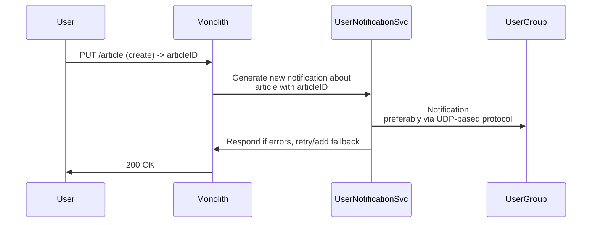
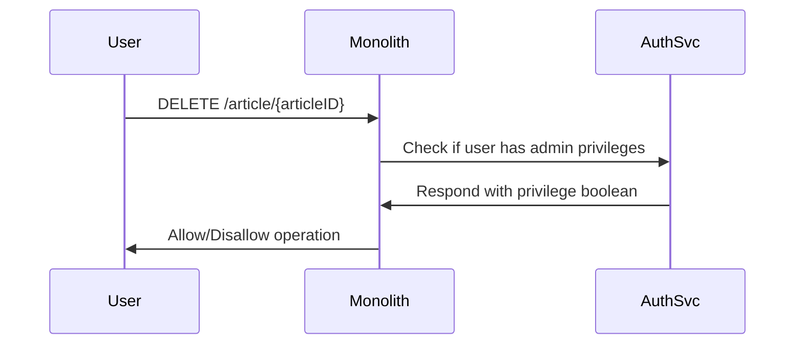
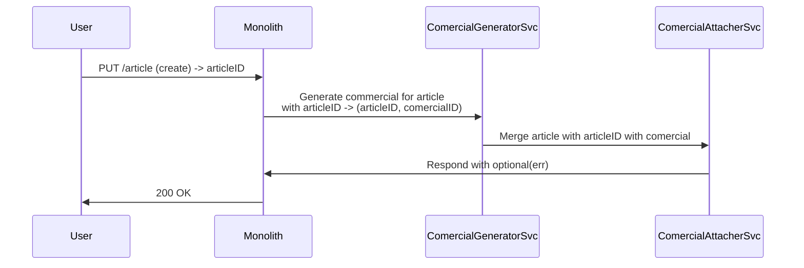

# hackathon-may

## Obecny backend
Dokumentacja routingu znajduje się w autogenerowanym pliku [routes.md](docs/routes.md) (`make documentation`).
Aplikacja wspiera bardzo prosty CRUD - tworzenie/update i czytanie metadanych artykułów oraz administracyjny delete.

W kodzie zaszyte są również mock calle do zewnętrznych serwisów, które mają spełniać założenia klienckie:
- auth dla administratorów
- propagacja notyfikacji - generowanie notyfikacji dla użytkowników z listy mailingowej, gdy zostaje stworzony nowy artykuł
- dołączanie `reklam` do nowo stworzonego artykułu

## Flow charts

_Cała komunikacja między monolitem a serwisami nie musi być synchroniczna/dwukierunkowa/stanowa etc..._
_Connection flowy również nie są określone na sztywno, możemy omówić jak połączyć te mikroserwisy, żeby zapewnić większą współpracę między wami_
_Dorzucajcie też swoje pomysły na fukcjonalności, żeby rozszerzyć koncept_

### **User Notification Service**

### **Authentication Service**

### **Comercials Services**

